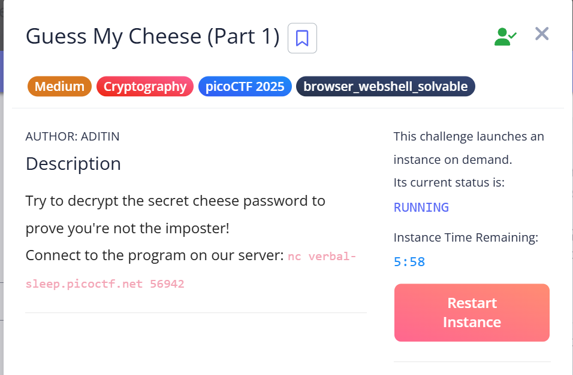
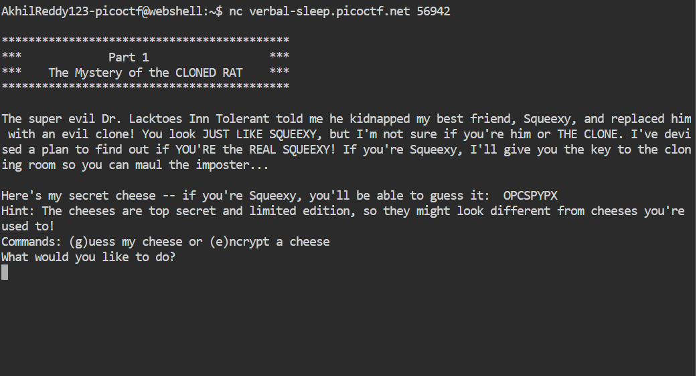
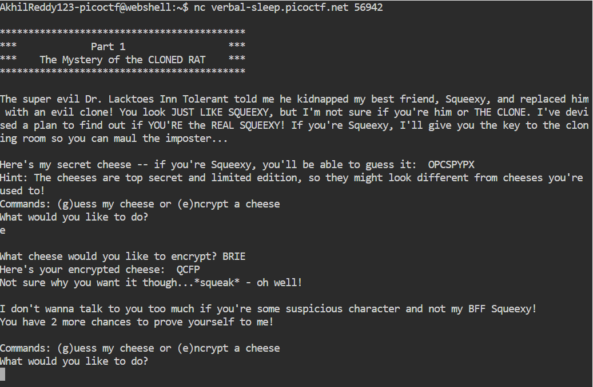
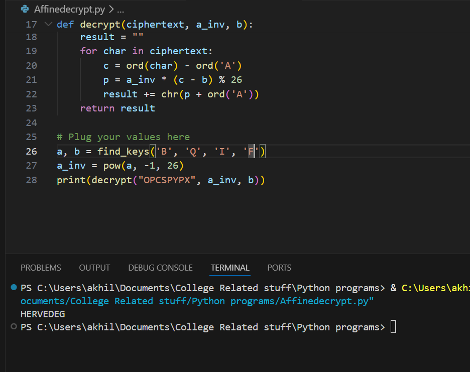
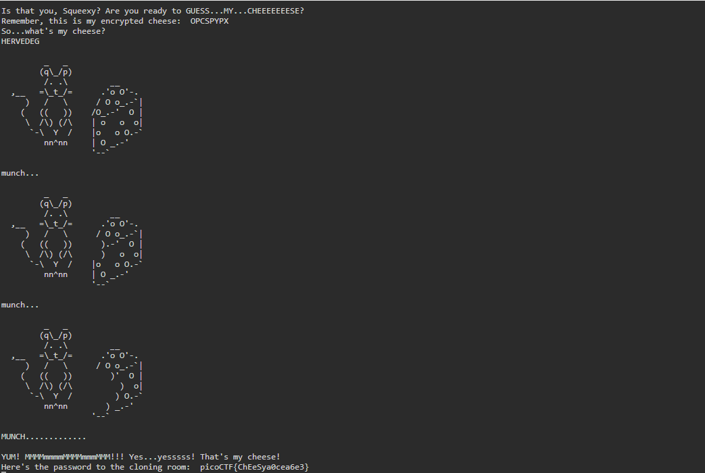

# picoCTF 2025 - Crypto - Guess My Cheese Part 1

**Date:** 20 March 2026  
**Time:** —

---

## Challenge Information

* **Challenge Name:** Guess My Cheese Part 1
* **Category:** Cryptography
* **Platform:** picoCTF
* **Difficulty:** Medium
* **Tags:** Affine Cipher, Key Recovery, Encryption Oracle, Modular Arithmetic

---

## Challenge Description

Try to decrypt the secret cheese password to prove you're not the imposter!  
Connect to the program on our server: `nc verbal-sleep.picoctf.net 51000`



---

## Given Information

On connecting to the server via `netcat`, the server presents:

* An **encrypted cheese name** (ciphertext) — the secret to guess
* Two commands: **(g)uess** my cheese or **(e)ncrypt** a cheese
* A limited number of **3 attempts** before the session ends



---

## Key Observations

* The server provides an **encryption oracle** — it will encrypt any valid cheese name you provide.
* Only real cheese names are accepted for encryption (e.g., `BRIE`, `CHEDDAR`). Random words are rejected.
* The secret cheese name may look unusual — the server warns it is "limited edition."

### Cipher Identification

To identify the cipher, a known cheese (`BRIE`) was encrypted and the output was analyzed letter by letter:

* Each plaintext letter mapped to **exactly one** ciphertext letter — indicating a **monoalphabetic substitution cipher**.
* The shift between each plaintext-ciphertext pair was **not constant**, which rules out the **Caesar cipher** (Caesar always has a fixed shift).



For example, from `BRIE → RLQY`:

| Pair | Shift |
|------|-------|
| B → R | 17 - 1 = 16 |
| R → L | 11 - 17 = -6 |
| I → Q | 16 - 8 = 8 |

* Since the shifts are **different for every letter** but follow a clear mathematical pattern `C = (a × P + b) mod 26`, the cipher was identified as the **Affine Cipher**.
* Knowing any two plaintext-ciphertext letter pairs is enough to recover the secret keys `a` and `b`.
* The key `a` must be **coprime with 26** for the cipher to be invertible.

---

## Attack Strategy

* Connected to the server and noted the target ciphertext.
* Used the **(e)ncrypt** option to encrypt a known cheese name (`BRIE`), obtaining a known plaintext-ciphertext pair.
* Analyzed the shift between each letter pair — shifts were **inconsistent**, ruling out Caesar cipher.
* Identified the cipher as **Affine** based on the mathematical pattern `C = (a × P + b) mod 26`.
* Selected two letter pairs from the known encryption where the difference of plaintext values is **coprime with 26** (i.e., `gcd(p1 - p2, 26) = 1`).
* Set up two simultaneous equations using the Affine cipher formula and solved for `a` and `b` by subtracting the equations to eliminate `b`.
* Computed the **modular inverse** of `a` mod 26 for decryption.
* Applied the decryption formula `P = a⁻¹ × (C - b) mod 26` to each letter of the target ciphertext.
* Submitted the recovered plaintext cheese name using the **(g)uess** option to obtain the flag.

---

## Key Recovery — Manual Walkthrough

From encrypting `BRIE → RLQY` (example session), taking two valid letter pairs:

| Plaintext Letter | Value (P) | Ciphertext Letter | Value (C) |
|------------------|-----------|-------------------|-----------|
| B                | 1         | R                 | 17        |
| I                | 8         | Z                 | 25        |

Setting up two equations:

```
17 = (a × 1 + b) mod 26   → equation 1
25 = (a × 8 + b) mod 26   → equation 2
```

Subtracting equation 1 from equation 2 (eliminates b):

```
8 = 7a mod 26
a = 8 × 7⁻¹ mod 26
```

Then solving for b using equation 1:

```
b = (c1 - a × p1) mod 26
```

---

## Code Snippet

**Complete Python Script (Reusable for any instance)**

```python
import math

# Step 1 - Key Recovery
def find_keys(plain1, cipher1, plain2, cipher2):
    p1 = ord(plain1) - ord('A')
    c1 = ord(cipher1) - ord('A')
    p2 = ord(plain2) - ord('A')
    c2 = ord(cipher2) - ord('A')

    # Check if the pair difference is coprime with 26
    if math.gcd(p1 - p2, 26) != 1:
        print("These pairs won't work! Try different letters.")
        return None, None

    a = (c1 - c2) * pow((p1 - p2), -1, 26) % 26
    b = (c1 - a * p1) % 26
    return a, b

# Step 2 - Decryption
def decrypt(ciphertext, a_inv, b):
    result = ""
    for char in ciphertext:
        c = ord(char) - ord('A')
        p = a_inv * (c - b) % 26
        result += chr(p + ord('A'))
    return result

# Step 3 - Main (plug your values here)
a, b = find_keys('B', 'R', 'I', 'Z')    # Replace with your known pair letters
a_inv = pow(a, -1, 26)
print(decrypt("YOUR_CIPHERTEXT_HERE", a_inv, b))  # Replace with target ciphertext
```



---

## Flag

* The recovered plaintext cheese name was submitted to the server.
* The server confirmed the correct answer and revealed the flag:

```
picoCTF{ChEeSya0cea6e3}
```



---

## Lessons Learned

1. The **Affine cipher** uses two keys (`a` and `b`) unlike Caesar cipher which uses only one shift value.
2. An **encryption oracle** (being able to encrypt chosen inputs) is a powerful tool — two known plaintext-ciphertext pairs are enough to fully break the cipher.
3. Affine cipher can be detected by checking if letter shifts are **inconsistent** across pairs — unlike Caesar where all shifts are equal.
4. The key `a` must be **coprime with 26** — always check `gcd(p1 - p2, 26) = 1` before solving.
5. In modular arithmetic, division is replaced by **multiplication by the modular inverse**.
6. Python's built-in `pow(x, -1, 26)` computes modular inverses efficiently — no manual calculation needed.

---

## Beginner Notes

* In modular arithmetic, negative numbers wrap around: `-1 mod 26 = 25`. Add 26 to any negative result to get the correct value.
* Not all letter pairs work for key recovery — if the difference of the plaintext values shares a common factor with 26, the modular inverse won't exist. Always pick pairs where `gcd(p1 - p2, 26) = 1`.
* The server only accepts real cheese names for encryption. Using random words will waste your limited attempts.
* Tools like **dcode.fr** and **CyberChef** can help identify unknown ciphers when no hint is given.

---

## End

This write-up was prepared based on personal notes taken during the solve with emphasis on clarity and reproducibility.
